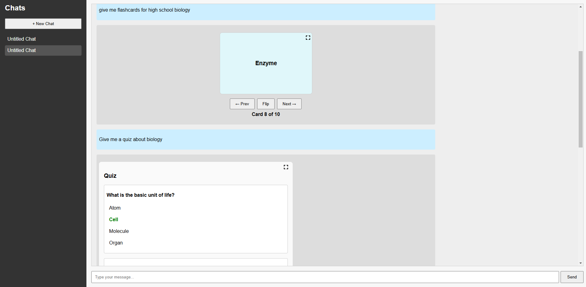
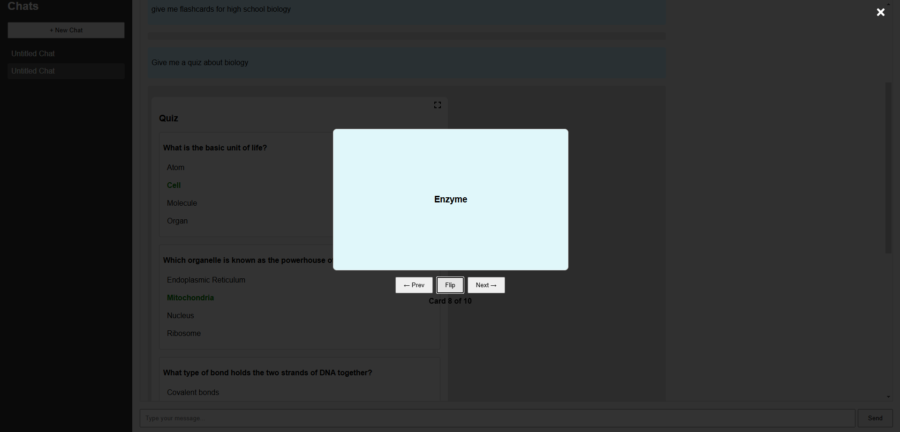
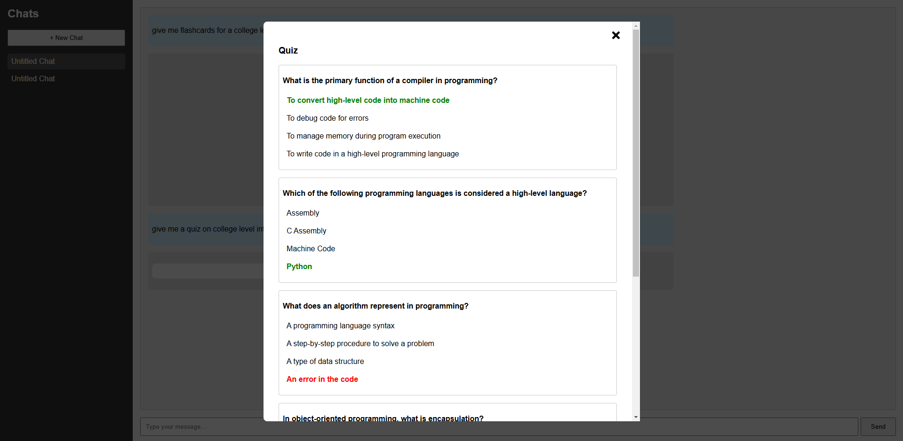

# 📚 Intelligent Tutoring System ✨

Welcome to the **Intelligent Tutoring System**, a full-stack application that provides chat-based tutoring, flashcards, and quiz functionalities. The goal of this project is to offer an experience similar to **ChatGPT** for educational purposes, with **flashcard** and **quiz** integrations inspired by **Quizlet**.  

## 📖 Table of Contents
- [📋 Overview](#overview)  
- [🚀 Features](#features)  
- [🛠️ Tech Stack](#tech-stack)  
- [🖼️ Screenshots & Images](#screenshots--images)  
- [⚙️ Setup Instructions](#setup-instructions)  
- [🧑‍🏫 Usage](#usage)  
- [📁 Folder Structure](#folder-structure)  
- [🤝 Contributing](#contributing)  
- [📜 License](#license)

---

## 📋 Overview
This project demonstrates an **AI-driven** educational platform leveraging **OpenAI** language models. Users can:
1. **Create multiple chats**.  
2. **Ask for help** on topics and get back **flashcards** or **quizzes**.  
3. **Store** chat conversations and **retrieve** them for quick navigation.  
4. Enjoy an interactive **flashcard UI** with flipping animations and **quiz** UI with immediate correct/wrong feedback.

---

## 🚀 Features
- 💬 **Chat-like** interface powered by AI.  
- 📂 **Multiple Chats**: each chat is stored separately, allowing a user to have different learning sessions.  
- 🃏 **Flashcard Generation**: 
  - Up to 10 flashcards.  
  - Quizlet-like animations (flip and slide transitions).  
  - Fullscreen mode.
- 📝 **Quiz Generation**:
  - Up to 5 multiple-choice questions.  
  - 🟢🔴 Red/Green feedback for correctness.  
  - Fullscreen mode.  
- 🗂️ **Persistent History**: All data stored in SQLite (with SQLAlchemy).  

---

## 🛠️ Tech Stack
| 🧰 Tech        | Description                      |
|-------------|----------------------------------|
| 🐍 **Python**  | Backend language                 |
| 🌐 **Flask**   | Web framework for the backend    |
| 🗃️ **SQLAlchemy** | ORM for managing SQLite DB   |
| ⚛️ **React** (Vite) | Frontend library + dev bundler  |
| 📡 **Axios**   | HTTP requests from React frontend|
| 🤖 **OpenAI**  | GPT-based text generation        |

---

## Chat UI

Here is what the Chat UI with Flashcards and Quizzes look like in line

You can expand any of the flashcards that are inline to have a more immersive view 

You can also expand any of the quizzes that are inline to have a more immersive view

